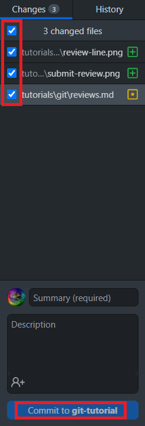

### Committing Changes
Commits can be thought of as points in the history of the repository, or groups of changes.
Each commit should be given a meaningful name that sums up the changes in that commit.
Please avoid situations like this:


Before creating the commit itself, you can choose what changes will be _`add`ed_ to the commit.

<div class="tab">
  <button class="tablinks" onclick="switchTo(event, 'cmd-commit')">Terminal</button>
  <button style="" class="tablinks" onclick="switchTo(event, 'ij-commit')">IntelliJ</button>
  <button style="" class="tablinks" onclick="switchTo(event, 'ghd-commit')">GitHub Desktop</button>
</div>

<details id="cmd-commit">

To add files and changes, use `git add`:
```ps
git add file1 file2 file3
```
The `*` wildcard can be used.

To create a commit, use `git commit`:
```ps
git commit -m "message"
```

</details>
<details id="ghd-commit">

Use the checkboxes on the left to select the files to add.
Write the commit message at the bottom, and press `Commit`.


</details>
<details id="ij-commit">

Click the green checkmark at the top-right.
Use the checkboxes to select the files to add.
Write the commit message, and press `Commit`.


</details>

<br/>