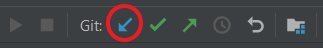
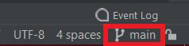
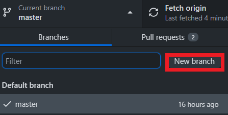

Creating a new branch allows you to add commits on a parallel version of the repository.
This can be used to test new features and not affect the `main` branch.
Later, the changes made in the branch can be added to the `main` branch once they are tested.

### Specifying the branch base
Before creating a new branch, you want to make sure that you are _basing_ the branch on the right commit - the last commit on the `main` branch. The _base_ commit of a branch is the last commit that is shared with the other branches. A branch can be moved to a different _base_ using _`rebase`_, but rebasing should be avoided unless needed. 

##### Pulling `origin`
To make sure that we are on the latest `main`, we _`pull`_ the latest changes from GitHub (`origin`):

<div class="tab">
  <button class="tablinks" onclick="switchTo(event, 'cmd-pull')">Terminal</button>
  <button class="tablinks" onclick="switchTo(event, 'ij-pull')">IntelliJ</button>
  <button class="tablinks" onclick="switchTo(event, 'ghd-pull')">GitHub Desktop</button>
</div>

<details id="cmd-pull">

```ps
git pull origin
```

</details>
<details id="ghd-pull">


Click `Fetch Origin`.

</details>
<details id="ij-pull">

The current branch name should be in the bottom-left corner.



If prompted, select `Rebase`.

</details>

##### Switching to `main`
We can make sure we're on `main` (in older repositories the main branch might be named `master`):

<div class="tab">
  <button class="tablinks" onclick="switchTo(event, 'cmd-switch')">Terminal</button>
  <button class="tablinks" onclick="switchTo(event, 'ij-switch')">IntelliJ</button>
  <button class="tablinks" onclick="switchTo(event, 'ghd-switch')">GitHub Desktop</button>
</div>

<details id="cmd-switch">

This command in any console (CMD, Powershell, Bash) will switch to the `main` branch.
```ps
git switch main
```

</details>
<details id="ghd-switch">


If a different branch name is displayed, switch to `main` by clicking on the display and selecting
`main`.

</details>
<details id="ij-switch">

The current branch name should be in the bottom-left corner.



If a different branch name is displayed, switch to `main` by opening the Branches panel (click on
the branch name) and then select `main > Checkout`.

</details>

### Creating a new branch
Now that we have the right base, create a new branch:

<div class="tab">
  <button class="tablinks" onclick="switchTo(event, 'cmd-create')">Terminal</button>
  <button class="tablinks" onclick="switchTo(event, 'ij-create')">IntelliJ</button>
  <button class="tablinks" onclick="switchTo(event, 'ghd-create')">GitHub Desktop</button>
</div>

<details id="cmd-create">

This command will create a new branch named `mybranch` based on the current one.
```ps
git switch -c mybranch
```

</details>
<details id="ghd-create">



Click `New Branch` and enter the name for the new branch.

</details>
<details id="ij-create">

Open `Git > New Branch` from the top menu, and enter a name for the new branch. 
Leave the `Checkout Branch` checkbox selected - otherwise you won't be switched to the new branch. 

</details>

<br/>