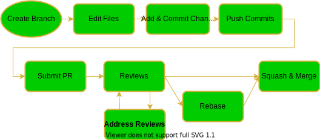

# Git Tutorial
A general explanation about git can be found [here](intro.html)
This tutorial explains the different stages of working with git in our team.
This graph shows the process, links to articles below.

List version of the process:
1. [**Create Branch**](create-branch.html)
2. **Edit Files** (no document, these are the changes you make to the code)
3. [**Add and Commit Changes**](commit.html)
4. [**Push Changes**](push.html)
5. [**Submit Pull Request**](create-pr.html)
6. [**Reviews**](reviews.html)
7. [**Rebase**](rebase.html) (not always relevant) 
