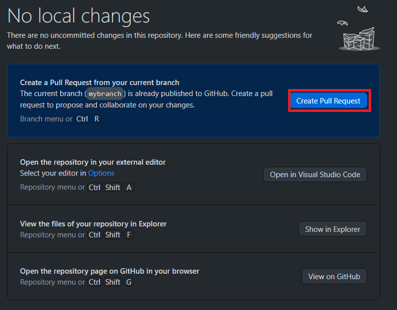
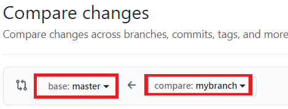

After [pushing](./push.html) your changes to GitHub, you can ask the repo admin to accept your changes. 
This is done with a _Pull Request_ (often called a PR).
A Pull Request has a _base branch_ (the branch that you want to add changes to, the one you created 
a branch from [here](./create-branch.md)), and a _compare branch_ (the branch with your changes, the one you created).


You can always open a Pull Request from [GitHub.com](https://github.com) by going to the `Pull Requests` tab on the repository page.
When pushing a branch from the terminal or from GitHub Desktop you can also open a PR right away:
<div class="tab">
  <button class="tablinks" onclick="switchTo(event, 'cmd-pr')">Terminal</button>
  <button class="tablinks" onclick="switchTo(event, 'ghd-pr')">GitHub Desktop</button>
</div>
<details id="cmd-pr">

In the terminal, a similar message will be printed (the line starting with `>` is the push command).
```ps
> git push --set-upstream origin mybranch

Total 0 (delta 0), reused 0 (delta 0), pack-reused 0
remote:
remote: Create a pull request for 'mybranch' on GitHub by visiting:
remote:      https://github.com/ExcaliburFRC/FRC-Curriculum/pull/new/mybranch
remote:
To https://github.com/ExcaliburFRC/FRC-Curriculum.git
 * [new branch]      mybranch -> mybranch
Branch 'mybranch' set up to track remote branch 'mybranch' from 'origin'.
```
As explained by the message, the first link will open [GitHub](https://github.com) with options to create a Pull Request.

</details>
<details id="ghd-pr">



Clicking on `Create Pull Request` will open [GitHub](https://github.com) with options to create a Pull Request.

</details>

### Comparing Changes
Once you get to the `Compare Changes` page, make sure that `base` is set to `main` (or `master` in older repositories) and `compare` is set to your branch.



A preview of the changes should appear below - additions in green and deletions in red. 
Then click on `Create Pull Request`, and enter a name and description for your PR.

Pull Requests have the same naming guidelines as commits (you'll see later in [Squash/Merge](./squash-merge.html)) - it should summarize the changes done in the PR.
- Some good examples: `Add Drive System`, `Change Shooter motor type`, `Update WPI Version`.
- Some bad examples: `fix error`, `door open`, `Auto.java`.

##### Automatic Linking
If the Pull Request fixes an Issue (most do), GitHub can automatically close the Issue once the PR is accepted.
Adding `Fixes #num` to the PR description (`num` is the Issue number, all Issues have one) will link that Issue to the Pull Request.
