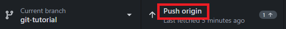
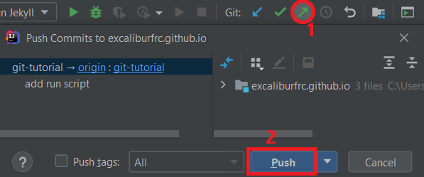

Once you have commits, you can `push` them to the remote (`origin` - GitHub):

<div class="tab">
  <button class="tablinks" onclick="switchTo(event, 'cmd-push')">Terminal</button>
  <button style="" class="tablinks" onclick="switchTo(event, 'ij-push')">IntelliJ</button>
  <button style="" class="tablinks" onclick="switchTo(event, 'ghd-push')">GitHub Desktop</button>
</div>

<details id="cmd-push">

To push all local commits to the remote:
```ps
    git push
```
If this is the first time the branch is pushed, it will likely fail:
```ps
fatal: The current branch mybranch has no upstream branch.
    To push the current branch and set the remote as upstream, use

       git push --set-upstream origin mybranch
```
This is because `mybranch` doesn't have a remote counterpart yet.
The error message gives all the information needed: to push and set the remote branch use
```ps
git push --set-upstream origin mybranch
```


</details>
<details id="ghd-push">

Click `Push to origin`.



</details>
<details id="ij-push">

Click the green arrow at the top-right, then click `Push` in the dialog.



</details>

<br/>