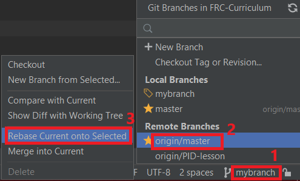
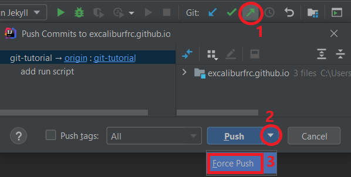

The `rebase` operation moves the base commit of the branch.
It takes all each commit and applies its changes on the new base commit instead of on the old one.
Usually, rebasing will be done onto a branch and not an actual commit - the new base commit will be the currently-latest commit on that branch.


### When are `rebase`s needed?
The main cause for needing to `rebase` is if the base branch (usually `origin/main`) of a Pull Request (PR) has commits added to it before the PR is merged.
When this happens, the PR branch (for example, `mybranch`) should be rebased on the commits that have been added to the base branch.
This is why you fetch the latest `origin/main` and then rebase onto it.

##### Pull
Before rebasing, make sure that `origin/main` is up-to-date and that you are on the branch you want to rebase (here: `mybranch`).
That is covered [here](./create-branch.html#pulling-codeorigincode).
Then we will rebase `mybranch` onto `origin/main`.

##### Rebase
<div class="tab">
  <button class="tablinks" onclick="switchTo(event, 'cmd-rebase')">Terminal</button>
  <button style="" class="tablinks" onclick="switchTo(event, 'ij-rebase')">IntelliJ</button>
  <button style="" class="tablinks" onclick="switchTo(event, 'ghd-rebase')">GitHub Desktop</button>
</div>

<details id="cmd-rebase">

```ps
git rebase origin/main
```

</details>
<details id="ghd-rebase">

Click on `Branch > Rebase current branch`, select the branch to rebase onto, and click `Start rebase`.


</details>
<details id="ij-rebase">

Open the Branches panel, click on `origin/main`, and then on `Rebase Current onto Selected`.




---

**! Note:** do **not** select `Checkout and rebase onto current`, as it will rebase `main` on `mybranch` and not the other way around.

</details>

---

##### Force-Push
After rebasing, we will need to _force-push_ - the commit history of our branch changed, so GitHub will reject a normal `push`.

## **!!! Be careful with force-pushing !!!**
## **!!! It can delete your work forever !!!**

<div class="tab">
  <button class="tablinks" onclick="switchTo(event, 'cmd-forcepush')">Terminal</button>
  <button style="" class="tablinks" onclick="switchTo(event, 'ij-forcepush')">IntelliJ</button>
  <button style="" class="tablinks" onclick="switchTo(event, 'ghd-forcepush')">GitHub Desktop</button>
</div>

<details id="cmd-forcepush">

```ps
git push --force-with-lease
```

</details>
<details id="ghd-forcepush">

GitHub Desktop does not support force-pushing. Use the terminal/command-line or IntelliJ.

</details>
<details id="ij-forcepush">

As with regular `push`ing, click on the green arrow on the top-left corner of the screen to open the push dialog.
Unlike with regular pushing, click on the triangle next to `Push` and click on `Force Push`.



</details>

---

