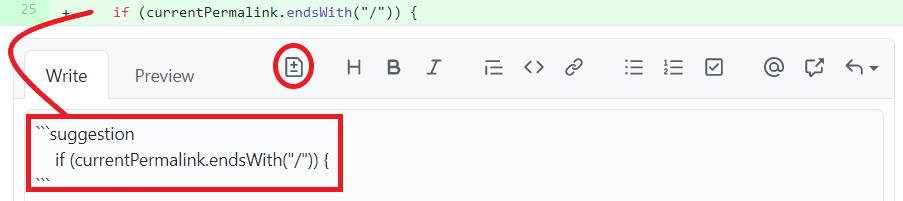
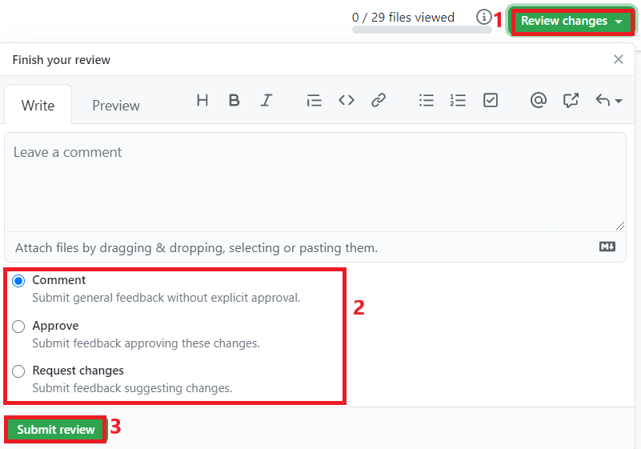

### Reviews
After you open a Pull Request, others can review it. Similarly, you can review Pull Requests made by other people.

Open the PR's page, and switch to the `Files Changed` tab. This page will show all changes made by
the Pull Request, additions in green and deletions in red. 

#### Adding a Review
Hover on a line in the change view, and click on the blue `+` icon that appears. You can select multiple lines by dragging the blue plus.
A review panel with open, with a textbox where you can write specific feedback on that change.

You can also suggest a change by clicking on the file icon with a plus and a minus.

This will add a MarkDown codebox with the selected line of code. Edits made to the line of code will
be added as suggestions.

Unless it is a single comment, click `Start a review`.

##### Submit a Review
After adding all your review comments, click on `Review Changes` at the top of the page. You can write a general message for the review in the text box.

Then you have three options:
- `Comment`: general feedback (this is the least used option).
- `Approve`: approve the changes, allows the PR to be merged into the repository.
- `Request Changes`: request changes/fixes, prevents the PR from being merged.

#### Addressing reviews
Line-specific reviews will be shown in the `Files` tab, and you can reply directly (each review has a chat box).
You can commit suggestions directly from GitHub by clicking `Commit Suggestion`, or add multiple suggestions in the same commit from the `Files` tab by clicking `Add to batch` on each suggestion and then `Commit Batch`.
Don't forget to `pull` those commits to your computer before making more changes.
After addressing all review comments, you can re-request a review from someone by clicking the arrow circle next to their name. 
