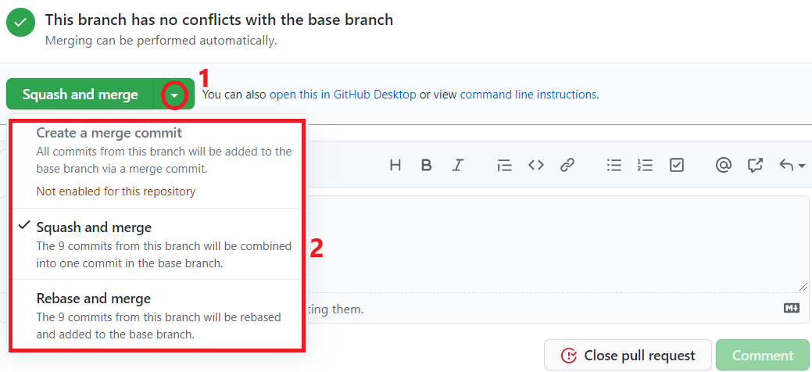

Once a Pull Request has been [approved](./reviews.html#submit-a-review), it can be merged into the repository. 
A Pull Request with requested changes cannot be merged.

### Merge Methods
There are three ways to merge Pull Request changes to the main repository/branch.
Repository/Organization admins can disable any of these options, but at least one must be enabled.
The three types are `merge`, `squash`, and `rebase`:

##### Merge
- adds all commits on branch by a [_merge commit_](https://www.atlassian.com/git/tutorials/using-branches/git-merge)
- keeps individual commits (keeps history of the feature branch)
- considered bad style, as they cause non-linear git histories (the merge commit
has two parent commits), making them harder to debug or revert (undo)

##### Squash
- squashes all PR changes into a single commit (which is then added to the main repo/branch) 
- keeps git history clean and ordered, each PR is a single commit
- you can't revert only part of the Pull Request
- this is the suggested merging method for most Pull Requests

##### Rebase
- [_rebases_](./rebase.html) all commits and adds them to the main branch/repo
- keeps individual commits
- linear git history (each commit has only one parent commit)

### Merging a Pull Request
If you have write access to the repository, you can merge Pull Requests (in any of the three methods).
If not (and even if you do), someone else with write access (in an FRC context, likely a mentor or lead programmer).

A `merge` box should appear above the textbox for commenting at the bottom of the PR page.
Click on the small triangle to open the options, and select the merge method you choose.

### Well done! You've merged your first Pull Request!
